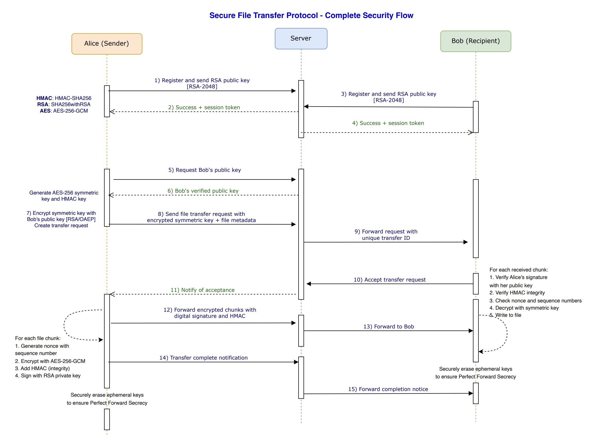

# Secure File Transfer Protocol

[](https://github.com/PramithaMJ/secure-file-transfer-protocol/actions/workflows/build.yml)

This project implements a secure file transfer protocol that ensures confidentiality, integrity, and protection against replay attacks. It uses a client-server architecture to support multiple users transferring files securely.

## Video Demo : [YouTube](https://youtu.be/0arjgfnfygI)
### For details output refer : [Logs](https://github.com/PramithaMJ/secure-file-transfer-protocol/tree/master/logs)

## Directory Structure

Directory structure:

```
└──-secure-file-transfer-protocol/
    ├── README.md
    ├── build.bat
    ├── build.sh
    ├── sonar-project.properties
    ├── data/
    │   ├── Alice_transfer_history.dat
    │   └── Bob_transfer_history.dat
    ├── docs/
    │   └── draw.io/
    │       ├── [Update]Security Flow Architecture.drawio
    │       ├── architecture.xml
    │       ├── Detailed_Security_Flow.drawio
    │       ├── Detailed_Security_Flow_with_Logs.drawio
    │       ├── Security Flow Architecture.drawio
    │       └── securityfllow.drawio
    ├── logs/
    │   └── security/
    │       ├── security_flow_emergency_1_0.log.lck
    │       ├── security_flow_emergency_2_0.log.lck
    │       └── security_flow_emergency_3_0.log.lck
    ├── resources/
    │   ├── config.properties
    │   └── logging.properties
    ├── src/
    │   ├── client/
    │   │   ├── Client.java
    │   │   ├── ClientConnectionHandler.java
    │   │   ├── ClientUI.java
    │   │   ├── TransferHistory.java
    │   │   └── TransferHistoryPanel.java
    │   ├── common/
    │   │   ├── CryptoUtils.java
    │   │   ├── FileTransferRequest.java
    │   │   ├── LoggingManager.java
    │   │   ├── Participant.java
    │   │   ├── RateLimitManager.java
    │   │   ├── ReplayTestUtils.java
    │   │   ├── SecureMessage.java
    │   │   ├── Session.java
    │   │   ├── SessionManager.java
    │   │   ├── SignedSecureMessage.java
    │   │   ├── TransferRecord.java
    │   │   └── User.java
    │   ├── server/
    │   │   ├── DoSMonitor.java
    │   │   ├── Server.java
    │   │   ├── ServerConnectionHandler.java
    │   │   └── UserManager.java
    │   └── utils/
    │       └── LoggingTest.java
    ├── .github/
    │   └── workflows/
    │       └── build.yml
    └── .scannerwork/
        └── .sonar_lock

```

## Java Version Requirement

**Important:** This application requires Java 17 or higher to run.

## Quick Start (macOS/Linux)

**Build the project:**

```bash
cd "Secure file transfer protocol"
rm -rf build
mkdir -p build
javac -d build src/common/*.java src/client/*.java src/server/*.java
```

**Run the server:**

```bash
java -cp build server.Server
```

**Run the client:**

```bash
java -cp build client.ClientUI
```

project implements a secure file transfer protocol that ensures confidentiality, integrity, and protection against replay attacks. It uses a client-server architecture to support multiple users transferring files securely.

---

### Secure File Transfer Protocol Flow



---

```
                                                 Server
                                                   |
                                                   |
                +-----------------------------------+--------------------------------+
                |                                                                    |
                |                                                                    |
                v                                                                    v
           Alice (Sender)                                                      Bob (Recipient)
               |                                                                    |
1) Alice registers with Server, generates RSA key pair                              |
   and sends her public key to Server                                               |
   [RSA 2048-bit]                                                                   |
               |                                                                    |
2) Server stores Alice's public key in user registry                                |
               |                                                                    |
               |                                                                    |
               |                                         3) Bob registers with Server, generates
               |                                            RSA key pair and sends his public key
               |                                            [RSA 2048-bit]
               |                                                                    |
               |                                         4) Server stores Bob's public key in 
               |                                            user registry
               |                                                                    |
5) Alice requests Bob's public key from Server                                      |
               |                                                                    |
6) Server sends Bob's verified public key to Alice                                  |
   (with server signature to prevent MITM)                                          |
               |                                                                    |
7) Alice generates session-specific symmetric key                                   |
   [AES-256] and HMAC key [SHA-256] for this transfer                               |
               |                                                                    |
8) Alice encrypts symmetric key with Bob's public key                               |
   [RSA/ECB/OAEPWITHSHA-256ANDMGF1PADDING]                                          |
               |                                                                    |
9) Alice sends transfer request to Server with                                      |
   encrypted symmetric key and file metadata                                        |
               |                                                                    |
10) Server assigns unique transfer ID and forwards                                  |
    request to Bob                                                                  |
               |                                                                    |
               |                                                                    v
               |                                         11) Bob receives transfer request with 
               |                                             encrypted symmetric key
               |                                                                    |
               |                                         12) Bob accepts transfer and sends
               |                                             acceptance to Server
               |                                                                    |
13) Server notifies Alice that Bob accepted                                         |
               |                                                                    |
14) For each file chunk:                                                            |
    a) Alice reads chunk from file                                                  |
    b) Alice generates secure nonce with chunk index                                |
    c) Alice encrypts chunk with AES-256-GCM                                        |
    d) Alice computes HMAC-SHA256 over encrypted data                               |
       + IV + timestamp + nonce                                                     |
    e) Alice signs the encrypted chunk with her private key                         |
       [SHA256withRSA]                                                              |
    f) Alice sends signed, encrypted chunk to Server                                |
               |                                                                    |
15) Server forwards signed, encrypted chunk to Bob                                  |
               |                                                                    v
               |                                         16) For each received chunk:
               |                                             a) Bob verifies Alice's signature with 
               |                                                her public key [SHA256withRSA]
               |                                             b) Bob decrypts the symmetric key with
               |                                                his private key [RSA decrypt]
               |                                             c) Bob verifies HMAC for integrity and
               |                                                anti-replay protection
               |                                             d) Bob decrypts chunk with AES-256-GCM
               |                                             e) Bob validates chunk sequence number
               |                                             f) Bob writes decrypted chunk to file
               |                                                                    |
17) Alice sends transfer complete message to Server                                 |
               |                                                                    |
18) Server forwards completion message to Bob                                       |
               |                                                                    v
               |                                         19) Bob marks transfer complete and 
               |                                             performs cleanup of ephemeral keys
               v                                                                    |
20) Alice performs cleanup of ephemeral keys                                        |
    to maintain Perfect Forward Secrecy (PFS)                                       |
```

## Participants

* **Alice (Sender)** - File sender
* **Server** - Central server handling key exchange and routing
* **Bob (Recipient)** - File receiver

## Cryptographic Specifications

* **HMAC**: HMAC-SHA256
* **RSA**: SHA256withRSA (RSA-2048)
* **AES**: AES-256-GCM

## Security Features

**Advanced Security Features:**

* Perfect Forward Secrecy
* Anti-replay protection
* Sequence validation
* Digital signatures
* Message integrity (HMAC)
* End-to-end encryption

## Protocol Flow

### Phase 1: Initial Registration and Key Exchange

1. **Alice → Server**: Register and send RSA public key [RSA-2048]
2. **Server → Alice**: Success + session token
3. **Bob → Server**: Register and send RSA public key [RSA-2048]
4. **Server → Bob**: Success + session token

### Phase 2: Key Distribution Setup

5. **Alice → Server**: Request Bob's public key
6. **Server → Alice**: Bob's verified public key

### Phase 3: Symmetric Key Generation and Distribution

7. **Alice (Internal)**:
   * Generate AES-256 symmetric key and HMAC key
   * Encrypt symmetric key with Bob's public key [RSA/OAEP]
   * Create transfer request
8. **Alice → Server**: Send file transfer request with encrypted symmetric key + file metadata
9. **Server → Bob**: Forward request with unique transfer ID

### Phase 4: Transfer Authorization

10. **Bob → Server**: Accept transfer request
11. **Server → Alice**: Notify of acceptance

### Phase 5: Secure File Transfer

12. **Alice (Internal Processing)**: For each file chunk:
    * Generate nonce with sequence number
    * Encrypt with AES-256-GCM
    * Add HMAC (integrity)
    * Sign with RSA private key
13. **Alice → Server**: Forward encrypted chunks with digital signature and HMAC
14. **Server → Bob**: Forward to Bob
15. **Bob (Internal Processing)**: For each received chunk:
    * Verify Alice's signature with her public key
    * Verify HMAC integrity
    * Check nonce and sequence numbers
    * Decrypt with symmetric key
    * Write to file

### Phase 6: Completion and Cleanup

16. **Alice → Server**: Transfer complete notification
17. **Server → Bob**: Forward completion notice
18. **Both Alice & Bob**: Securely erase ephemeral keys to ensure Perfect Forward Secrecy

## Security Analysis

This protocol implements multiple layers of security:

1. **Authentication**: RSA digital signatures ensure message authenticity
2. **Confidentiality**: AES-256-GCM provides strong encryption
3. **Integrity**: HMAC-SHA256 prevents tampering
4. **Forward Secrecy**: Ephemeral keys are securely erased after use
5. **Replay Protection**: Nonces and sequence numbers prevent replay attacks
6. **End-to-End Security**: Server cannot decrypt file contents

The protocol follows security best practices by combining asymmetric encryption for key exchange with symmetric encryption for bulk data transfer, ensuring both security and performance.

Security Features

1. **Confidentiality**:

   - RSA encryption for key exchange (`CryptoUtils.RSA_TRANSFORMATION = "RSA/ECB/OAEPWITHSHA-256ANDMGF1PADDING"`)
   - AES-256 encryption for file contents (`CryptoUtils.AES_KEY_SIZE = 256`)
   - CBC mode with random IV for each chunk (`CryptoUtils.AES_TRANSFORMATION = "AES/CBC/PKCS5Padding"`)
2. **Integrity**:

   - HMAC-SHA256 verification for each chunk (`CryptoUtils.HMAC_ALGORITHM = "HmacSHA256"`)
   - HMAC covers encrypted data, IV, timestamp, and nonce
3. **Authentication**:

   - Server authenticates clients via user accounts (`UserManager.authenticateUser()`)
   - Clients verify server responses with digital signatures
   - Session-based authentication using secure tokens (`SessionManager.generateSessionToken()`)
4. **Perfect Forward Secrecy**:

   - New symmetric keys generated for each file transfer (`Client.sendFile()`)
   - Ephemeral AES keys protect against compromise of long-term keys
5. **Anti-Replay Protection**:

   - Unique nonce for each chunk (`SecureRandom.getInstanceStrong().nextBytes(nonceBytes)`)
   - Timestamp validation with 5-minute window (`MAX_MESSAGE_AGE_MS = 5 * 60 * 1000`)
   - Server-side tracking of used nonces (`usedNonces` ConcurrentHashMap)
   - Automatic cleanup of old nonces with scheduled executor
6. **DoS Attack Protection**:

   - Rate limiting by IP address and user (`RateLimitManager.checkRateLimit()`)
   - Connection throttling with increasing penalties (`RateLimitManager.BandwidthTracker`)
   - Blacklisting of abusive IPs (`RateLimitManager.blacklistIP()`)
   - Continuous security monitoring (`DoSMonitor.performSecurityCheck()`)
7. **Path Traversal Protection**:

   - Filename validation and sanitization
   - Secure file path creation with Path.normalize()
   - Prevention of directory traversal attacks (`..` and other unsafe sequences)
8. **Public Key Validation**:

   - Minimum RSA 2048-bit key strength enforcement
   - Algorithm validation (RSA-only)
   - Key fingerprint generation for verification (`CryptoUtils.generateKeyFingerprint()`)
   - Prevention of key spoofing attacks
9. **Digital Signatures**:

   - SHA256withRSA digital signatures (`CryptoUtils.SIGNATURE_ALGORITHM = "SHA256withRSA"`)
   - Non-repudiation: cryptographic proof of sender identity
   - End-to-end authentication from sender to recipient

## How to Build and Run

### Prerequisites

- Java Development Kit (JDK) 17 or higher
- Java Swing (included in JDK)

### Detailed Build Instructions

#### macOS/Linux

```bash
# Clean and create build directory
cd "Secure file transfer protocol"
rm -rf build
mkdir -p build

# Compile all Java files to build directory
javac -d build src/common/*.java src/client/*.java src/server/*.java
```

#### Windows

```powershell
# Clean and create build directory
cd "Secure file transfer protocol"
if (Test-Path "build") { Remove-Item -Recurse -Force "build" }
New-Item -ItemType Directory -Path "build"

# Compile all Java files to build directory
javac -d build src\common\*.java src\client\*.java src\server\*.java
```

### Running the Application

#### Running the Server

```bash
# Start the server
cd "Secure file transfer protocol"
java -cp build server.Server
```

#### Running the Client

```bash
# Start the client GUI
cd "Secure file transfer protocol"
java -cp build client.ClientUI
```

### Troubleshooting

If you encounter an error about unsupported class version:

```
java.lang.UnsupportedClassVersionError: server/Server has been compiled by a more recent version of the Java Runtime
```

This means you're trying to run the application with an older Java version. Make sure to use Java 17 or higher:

```bash
# Check your Java version
java -version

# If using multiple Java versions, specify path to Java 17:
/path/to/java17/bin/java -cp build server.Server
```

## SonarQube Analysis

This project uses SonarQube for continuous code quality and security vulnerability assessment. The status badges at the top of this README show:

- **Quality Gate Status**: Overall health of the project based on defined quality thresholds
- **Security Rating**: Rating of security issues found (A = best, E = worst)
- **Vulnerabilities**: Number of security vulnerabilities detected

### Running Security Analysis

To run a security scan locally:

```bash
# Run the full security scan
./run-security-scan.sh

# Check for common security issues
./fix-security-issues.sh
```

### Viewing Results

Access the SonarQube dashboard for detailed analysis:

- [Project Dashboard](http://157.230.40.190:9000/dashboard?id=Pramitha)
- [Security Hotspots](http://157.230.40.190:9000/security_hotspots?id=Pramitha)
- [Vulnerabilities](http://157.230.40.190:9000/project/issues?id=Pramitha&resolved=false&types=VULNERABILITY)

### SonarQube Dashboard Screenshots

#### Overview Dashboard


#### Security Analysis


## User Interface Screenshots

### UI-1.png


The main client interface showing the login screen. Users can connect to the server by entering their username and server address.

### UI-2.png


File transfer window showing the file selection and recipient options. This screen allows users to initiate secure transfers to other connected users.

### UI-3.png


Transfer history panel displaying past and current file transfers with their statuses, timestamps, and recipients/senders.

### UI-4.png


Active transfer monitoring interface showing real-time progress of ongoing file transfers with encryption status.

### UI-5.png


Security settings panel allowing users to configure encryption strength and other security-related options.

## Log Output Screenshots

### For details output refer : [Logs](https://github.com/PramithaMJ/secure-file-transfer-protocol/tree/master/logs)

### log-1.png


Example of normal transfer logs showing successful encryption, integrity verification, and sequence tracking. Note the ordered sequence numbers indicating proper packet flow.

### log-2.png


Security alert logs showing detected replay attempts. The highlighted sections show the anti-replay protection system identifying duplicate sequence numbers with different nonces, a key indicator of potential replay attacks.

## SonarQube Integration

### sonar-cube-dashboard.png


Main SonarQube dashboard showing code quality metrics and security vulnerabilities overview.

### sonar-cube-dashboard-2.png


Detailed security vulnerability report from SonarQube with specific issues identified in the codebase.
