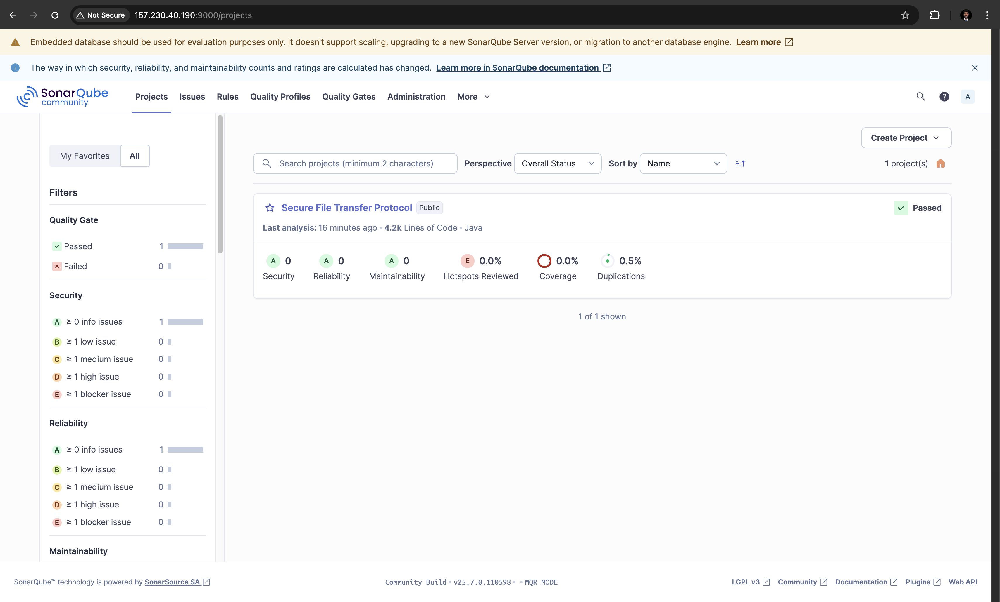

# Secure File Transfer Protocol

[](https://github.com/PramithaMJ/secure-file-transfer-protocol/actions/workflows/build.yml)

This project implements a secure file transfer protocol that ensures confidentiality, integrity, and protection against replay attacks. It uses a client-server architecture to support multiple users transferring files securely.

## Video Demo : [YouTube]()

## Java Version Requirement

**Important:** This application requires Java 17 or higher to run.

## Quick Start (macOS/Linux)

**Build the project:**

```bash
cd "Secure file transfer protocol"
rm -rf build
mkdir -p build
javac -d build src/common/*.java src/client/*.java src/server/*.java
```

**Run the server:**

```bash
java -cp build server.Server
```

**Run the client:**

```bash
java -cp build client.ClientUI
```

project implements a secure file transfer protocol that ensures confidentiality, integrity, and protection against replay attacks. It uses a client-server architecture to support multiple users transferring files securely.

## Security Features

1. **Confidentiality**:

   - RSA encryption for key exchange (`CryptoUtils.RSA_TRANSFORMATION = "RSA/ECB/OAEPWITHSHA-256ANDMGF1PADDING"`)
   - AES-256 encryption for file contents (`CryptoUtils.AES_KEY_SIZE = 256`)
   - CBC mode with random IV for each chunk (`CryptoUtils.AES_TRANSFORMATION = "AES/CBC/PKCS5Padding"`)
2. **Integrity**:

   - HMAC-SHA256 verification for each chunk (`CryptoUtils.HMAC_ALGORITHM = "HmacSHA256"`)
   - HMAC covers encrypted data, IV, timestamp, and nonce
3. **Authentication**:

   - Server authenticates clients via user accounts (`UserManager.authenticateUser()`)
   - Clients verify server responses with digital signatures
   - Session-based authentication using secure tokens (`SessionManager.generateSessionToken()`)
4. **Perfect Forward Secrecy**:

   - New symmetric keys generated for each file transfer (`Client.sendFile()`)
   - Ephemeral AES keys protect against compromise of long-term keys
5. **Anti-Replay Protection**:

   - Unique nonce for each chunk (`SecureRandom.getInstanceStrong().nextBytes(nonceBytes)`)
   - Timestamp validation with 5-minute window (`MAX_MESSAGE_AGE_MS = 5 * 60 * 1000`)
   - Server-side tracking of used nonces (`usedNonces` ConcurrentHashMap)
   - Automatic cleanup of old nonces with scheduled executor
6. **DoS Attack Protection**:

   - Rate limiting by IP address and user (`RateLimitManager.checkRateLimit()`)
   - Connection throttling with increasing penalties (`RateLimitManager.BandwidthTracker`)
   - Blacklisting of abusive IPs (`RateLimitManager.blacklistIP()`)
   - Continuous security monitoring (`DoSMonitor.performSecurityCheck()`)
7. **Path Traversal Protection**:

   - Filename validation and sanitization
   - Secure file path creation with Path.normalize()
   - Prevention of directory traversal attacks (`..` and other unsafe sequences)
8. **Public Key Validation**:

   - Minimum RSA 2048-bit key strength enforcement
   - Algorithm validation (RSA-only)
   - Key fingerprint generation for verification (`CryptoUtils.generateKeyFingerprint()`)
   - Prevention of key spoofing attacks
9. **Digital Signatures**:

   - SHA256withRSA digital signatures (`CryptoUtils.SIGNATURE_ALGORITHM = "SHA256withRSA"`)
   - Non-repudiation: cryptographic proof of sender identity
   - End-to-end authentication from sender to recipient

## How to Build and Run

### Prerequisites

- Java Development Kit (JDK) 17 or higher
- Java Swing (included in JDK)

### Detailed Build Instructions

#### macOS/Linux

```bash
# Clean and create build directory
cd "Secure file transfer protocol"
rm -rf build
mkdir -p build

# Compile all Java files to build directory
javac -d build src/common/*.java src/client/*.java src/server/*.java
```

#### Windows

```powershell
# Clean and create build directory
cd "Secure file transfer protocol"
if (Test-Path "build") { Remove-Item -Recurse -Force "build" }
New-Item -ItemType Directory -Path "build"

# Compile all Java files to build directory
javac -d build src\common\*.java src\client\*.java src\server\*.java
```

### Running the Application

#### Running the Server

```bash
# Start the server
cd "Secure file transfer protocol"
java -cp build server.Server
```

#### Running the Client

```bash
# Start the client GUI
cd "Secure file transfer protocol"
java -cp build client.ClientUI
```

### Troubleshooting

If you encounter an error about unsupported class version:

```
java.lang.UnsupportedClassVersionError: server/Server has been compiled by a more recent version of the Java Runtime
```

This means you're trying to run the application with an older Java version. Make sure to use Java 17 or higher:

```bash
# Check your Java version
java -version

# If using multiple Java versions, specify path to Java 17:
/path/to/java17/bin/java -cp build server.Server
```

## SonarQube Analysis

This project uses SonarQube for continuous code quality and security vulnerability assessment. The status badges at the top of this README show:

- **Quality Gate Status**: Overall health of the project based on defined quality thresholds
- **Security Rating**: Rating of security issues found (A = best, E = worst)
- **Vulnerabilities**: Number of security vulnerabilities detected

### Running Security Analysis

To run a security scan locally:

```bash
# Run the full security scan
./run-security-scan.sh

# Check for common security issues
./fix-security-issues.sh
```

### Viewing Results

Access the SonarQube dashboard for detailed analysis:

- [Project Dashboard](http://157.230.40.190:9000/dashboard?id=Pramitha)
- [Security Hotspots](http://157.230.40.190:9000/security_hotspots?id=Pramitha)
- [Vulnerabilities](http://157.230.40.190:9000/project/issues?id=Pramitha&resolved=false&types=VULNERABILITY)

### SonarQube Dashboard Screenshots

#### Overview Dashboard



#### Security Analysis


## User Interface Screenshots

### UI-1.png


The main client interface showing the login screen. Users can connect to the server by entering their username and server address.

### UI-2.png


File transfer window showing the file selection and recipient options. This screen allows users to initiate secure transfers to other connected users.

### UI-3.png


Transfer history panel displaying past and current file transfers with their statuses, timestamps, and recipients/senders.

### UI-4.png


Active transfer monitoring interface showing real-time progress of ongoing file transfers with encryption status.

### UI-5.png


Security settings panel allowing users to configure encryption strength and other security-related options.

## Log Output Screenshots

### log-1.png


Example of normal transfer logs showing successful encryption, integrity verification, and sequence tracking. Note the ordered sequence numbers indicating proper packet flow.

### log-2.png


Security alert logs showing detected replay attempts. The highlighted sections show the anti-replay protection system identifying duplicate sequence numbers with different nonces, a key indicator of potential replay attacks.

## SonarQube Integration

### sonar-cube-dashboard.png


Main SonarQube dashboard showing code quality metrics and security vulnerabilities overview.

### sonar-cube-dashboard-2.png


Detailed security vulnerability report from SonarQube with specific issues identified in the codebase.
