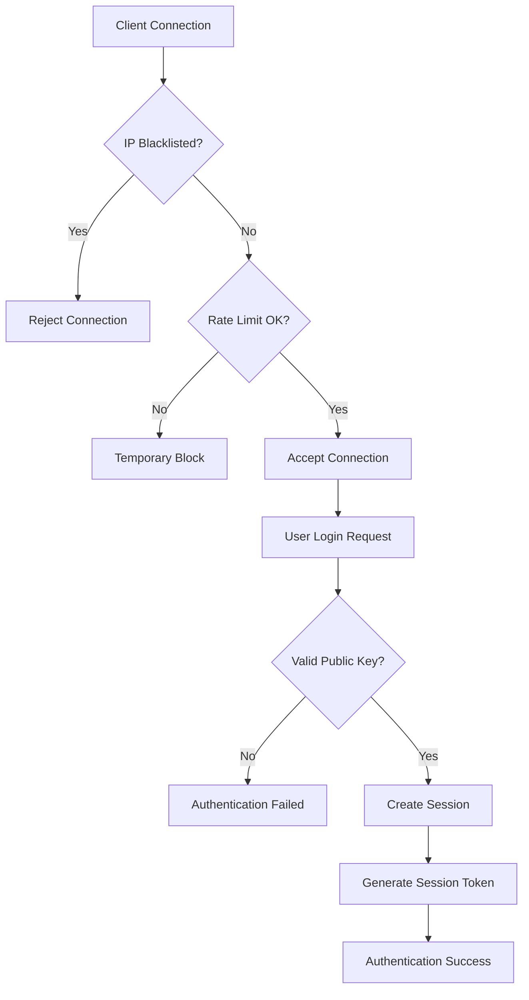

# Security Flow Analysis

## Secure File Transfer Protocol - Step-by-Step Security Implementation

This document provides an interactive, step-by-step analysis of how security is implemented and maintained throughout the entire file transfer process, similar to the mutual authentication diagram shown in the reference image.

---

## Complete Security Flow Diagram

### Phase 1: Initial Connection and Authentication

```
┌─────────────────┐                ┌─────────────────┐                ┌─────────────────┐
│      Alice      │                │      Server     │                │       Bob       │
│  (Client/Sender)│                │   (Relay Hub)   │                │(Client/Receiver)│
└─────────────────┘                └─────────────────┘                └─────────────────┘
         │                                                       │                                                       │
         │ 1. Alice TCP Connection Request                  │                                                       │
         │─────────────────────────────────────────────────→│                                                       │
         │                                                       │                                                       │
         │                            2. DoS Protection Check   │                                                       │
         │                               ┌─────────────────────┐ │                                                       │
         │                               │ • IP Blacklist      │ │                                                       │
         │                               │ • Rate Limiting     │ │                                                       │
         │                               │ • Connection Count  │ │                                                       │
         │                               └─────────────────────┘ │                                                       │
         │                                                       │                                                       │
         │ 3. Connection Accepted                                │                                                       │
         │←─────────────────────────────────────────────────────│                                                       │
         │                                                       │                                                       │
         │ 4. Alice User Registration/Login                      │                                                       │
         │ USER_LOGIN{username: alice, RSA_PublicKey}            │                                                       │
         │─────────────────────────────────────────────────────→│                                                       │
         │                                                       │                                                       │
         │                            5. Alice Authentication   │                                                       │
         │                               ┌─────────────────────┐ │                                                       │
         │                               │ • Public Key Validation │                                                   │
         │                               │ • User Registration │ │                                                       │
         │                               │ • Session Creation  │ │                                                       │
         │                               └─────────────────────┘ │                                                       │
         │                                                       │                                                       │
         │ 6. Authentication Success + Session Token            │                                                       │
         │ LOGIN_SUCCESS{sessionToken}                          │                                                       │
         │←─────────────────────────────────────────────────────│                                                       │
         │                                                       │                                                       │
         │                                                       │ 7. Bob TCP Connection Request                        │
         │                                                       │←─────────────────────────────────────────────────────│
         │                                                       │                                                       │
         │                                                       │ 8. Bob DoS Protection Check                         │
         │                                                       │ ┌─────────────────────┐                             │
         │                                                       │ │ • IP Blacklist      │                             │
         │                                                       │ │ • Rate Limiting     │                             │
         │                                                       │ │ • Connection Count  │                             │
         │                                                       │ └─────────────────────┘                             │
         │                                                       │                                                       │
         │                                                       │ 9. Bob Connection Accepted                          │
         │                                                       │─────────────────────────────────────────────────────→│
         │                                                       │                                                       │
         │                                                       │ 10. Bob User Registration/Login                     │
         │                                                       │ USER_LOGIN{username: bob, RSA_PublicKey}             │
         │                                                       │←─────────────────────────────────────────────────────│
         │                                                       │                                                       │
         │                                                       │ 11. Bob Authentication                              │
         │                                                       │ ┌─────────────────────┐                             │
         │                                                       │ │ • Public Key Validation │                         │
         │                                                       │ │ • User Registration │                             │
         │                                                       │ │ • Session Creation  │                             │
         │                                                       │ └─────────────────────┘                             │
         │                                                       │                                                       │
         │                                                       │ 12. Bob Authentication Success + Session Token      │
         │                                                       │ LOGIN_SUCCESS{sessionToken}                         │
         │                                                       │─────────────────────────────────────────────────────→│
```

### Phase 2: Perfect Forward Secrecy Setup

```
         │                                                       │                                                       │
         │ 13. Alice File Transfer Initiation                   │                                                       │
         │ ┌─────────────────────────────────────────────────┐   │                                                       │
         │ │ • Generate Ephemeral DH Key Pair (2048-bit)    │   │                                                       │
         │ │ • DH_PrivKey_A, DH_PubKey_A                     │   │                                                       │
         │ │ • Sign DH_PubKey_A with RSA_PrivKey_A           │   │                                                       │
         │ └─────────────────────────────────────────────────┘   │                                                       │
         │                                                       │                                                       │
         │ 14. Alice Signed DH Public Key to Server             │                                                       │
         │ FileTransferRequest{                                 │                                                       │
         │   filename, filesize, targetUser: "bob",             │                                                       │
         │   senderDHPublicKey: DH_PubKey_A,                   │                                                       │
         │   senderDHPublicKeySignature: Sign(DH_PubKey_A)      │                                                       │
         │ }                                                    │                                                       │
         │─────────────────────────────────────────────────────→│                                                       │
         │                                                       │                                                       │
         │                                15. Server Relay to Bob│ 16. Bob Transfer Notification                        │
         │                                                       │ FileTransferRequest{                                 │
         │                                                       │   filename, filesize, sender: "alice",              │
         │                                                       │   senderDHPublicKey: DH_PubKey_A,                   │
         │                                                       │   senderDHPublicKeySignature: Sign(DH_PubKey_A)      │
         │                                                       │ }                                                    │
         │                                                       │─────────────────────────────────────────────────────→│
         │                                                       │                                                       │
         │                                                       │                              17. Bob DH Key Generation│
         │                                                       │                                ┌─────────────────────┐│
         │                                                       │                                │ • Verify Alice's sig││
         │                                                       │                                │ • Generate DH Keys ││
         │                                                       │                                │ • DH_PrivKey_B,    ││
         │                                                       │                                │   DH_PubKey_B       ││
         │                                                       │                                │ • Sign DH_PubKey_B  ││
         │                                                       │                                └─────────────────────┘│
         │                                                       │                                                       │
         │                                                       │ 18. Bob's DH Public Key Response                     │
         │                                                       │ FileTransferResponse{                                │
         │                                                       │   transferId,                                        │
         │                                                       │   receiverDHPublicKey: DH_PubKey_B,                 │
         │                                                       │   receiverDHPublicKeySignature: Sign(DH_PubKey_B)    │
         │                                                       │ }                                                    │
         │                                                       │←─────────────────────────────────────────────────────│
         │                                                       │                                                       │
         │ 19. Server Relay to Alice                             │                                                       │
         │ FileTransferResponse{                                │                                                       │
         │   transferId,                                        │                                                       │
         │   receiverDHPublicKey: DH_PubKey_B,                 │                                                       │
         │   receiverDHPublicKeySignature: Sign(DH_PubKey_B)    │                                                       │
         │ }                                                    │                                                       │
         │←─────────────────────────────────────────────────────│                                                       │
         │                                                       │                                                       │
         │ 20. Alice Shared Secret Derivation                   │                              21. Bob Shared Secret Derivation│
         │ ┌─────────────────────────────────────────────────┐   │                                ┌─────────────────────┐│
         │ │ • Verify Bob's DH signature                     │   │                                │ • Already verified  ││
         │ │ • SharedSecret = DH(DH_PrivKey_A, DH_PubKey_B)  │   │                                │   Alice's signature ││
         │ │ • AES_Key = SHA256(SharedSecret)                │   │                                │ • SharedSecret =   ││
         │ │ • HMAC_Key derived from SharedSecret           │   │                                │   DH(DH_PrivKey_B, ││
         │ └─────────────────────────────────────────────────┘   │                                │   DH_PubKey_A)      ││
         │                                                       │                                │ • AES_Key = SHA256 ││
         │                                                       │                                │   (SharedSecret)    ││
         │                                                       │                                │ • HMAC_Key derived ││
         │                                                       │                                └─────────────────────┘│
```

### Phase 3: Secure Data Transmission with Anti-Replay Protection

```
         │                                                       │                                                       │
         │ 22. Alice File Chunking and Encryption               │                                                       │
         │ ┌─────────────────────────────────────────────────┐   │                                                       │
         │ │ FOR each 4KB chunk (i = 0 to n):               │   │                                                       │
         │ │   • Generate unique IV                          │   │                                                       │
         │ │   • Generate secure nonce: baseNonce:i         │   │                                                       │
         │ │   • Encrypt: AES-256-CBC(chunk, AES_Key, IV)   │   │                                                       │
         │ │   • Calculate: HMAC-SHA256(encrypted+IV+        │   │                                                       │
         │ │     timestamp+nonce+sequence)                   │   │                                                       │
         │ │   • Create SecureMessage                        │   │                                                       │
         │ │   • Sign: RSA-SHA256(SecureMessage)             │   │                                                       │
         │ └─────────────────────────────────────────────────┘   │                                                       │
         │                                                       │                                                       │
         │ 23. Alice Sends Signed Encrypted Chunk to Server     │                                                       │
         │ SIGNED_CHUNK|transferId|chunkIndex|totalChunks        │                                                       │
         │ SignedSecureMessage{                                 │                                                       │
         │   secureMessage: {                                   │                                                       │
         │     encryptedData,                                   │                                                       │
         │     mac: HMAC-SHA256(...),                          │                                                       │
         │     iv, timestamp,                                   │                                                       │
         │     nonce: "abc123:0"  // sequence embedded         │                                                       │
         │   },                                                 │                                                       │
         │   signature: RSA-Sign(secureMessage),               │                                                       │
         │   senderUsername: "alice"                            │                                                       │
         │ }                                                    │                                                       │
         │─────────────────────────────────────────────────────→│                                                       │
         │                                                       │                                                       │
         │                         24. Server Relay to Bob      │ 25. Bob Receives Signed Encrypted Chunk              │
         │                                                       │ SIGNED_CHUNK|transferId|chunkIndex|totalChunks        │
         │                                                       │ SignedSecureMessage{                                 │
         │                                                       │   secureMessage: {                                   │
         │                                                       │     encryptedData,                                   │
         │                                                       │     mac: HMAC-SHA256(...),                          │
         │                                                       │     iv, timestamp,                                   │
         │                                                       │     nonce: "abc123:0"                               │
         │                                                       │   },                                                 │
         │                                                       │   signature: RSA-Sign(secureMessage),               │
         │                                                       │   senderUsername: "alice"                            │
         │                                                       │ }                                                    │
         │                                                       │─────────────────────────────────────────────────────→│
         │                                                       │                                                       │
         │                                                       │                           26. Bob Multi-Layer Verification│
         │                                                       │                             ┌─────────────────────────┐│
         │                                                       │                             │ Layer 1: Digital Signature││
         │                                                       │                             │ • Verify Alice's RSA sig││
         │                                                       │                             │ • Authenticate sender   ││
         │                                                       │                             │                         ││
         │                                                       │                             │ Layer 2: Anti-Replay    ││
         │                                                       │                             │ • Check nonce uniqueness││
         │                                                       │                             │ • Validate timestamp    ││
         │                                                       │                             │ • Verify sequence order ││
         │                                                       │                             │                         ││
         │                                                       │                             │ Layer 3: Data Integrity ││
         │                                                       │                             │ • Verify HMAC-SHA256    ││
         │                                                       │                             │ • Decrypt chunk         ││
         │                                                       │                             │ • Validate data         ││
         │                                                       │                             └─────────────────────────┘│
         │                                                       │                                                       │
         │                                                       │ 27. Bob Sends Chunk Acknowledgment to Server         │
         │                                                       │ CHUNK_ACK|transferId|chunkIndex                      │
         │                                                       │←─────────────────────────────────────────────────────│
         │                                                       │                                                       │
         │ 28. Server Relay Acknowledgment to Alice             │                                                       │
         │ CHUNK_ACK|transferId|chunkIndex                      │                                                       │
         │←─────────────────────────────────────────────────────│                                                       │
         │                                                       │                                                       │
         │ [Repeat steps 23-28 for each chunk]                 │                                                       │
         │                                                       │                                                       │
         │ 29. Alice Transfer Completion Signal                 │                                                       │
         │ TRANSFER_COMPLETE|transferId                         │                                                       │
         │─────────────────────────────────────────────────────→│                                                       │
         │                                                       │                                                       │
         │                           30. Server Relay to Bob    │ 31. Bob Transfer Completion                          │
         │                                                       │ TRANSFER_COMPLETE|transferId                         │
         │                                                       │─────────────────────────────────────────────────────→│
         │                                                       │                                                       │
         │                                                       │                             32. Bob Security Cleanup │
         │                                                       │                             ┌─────────────────────────┐│
         │                                                       │                             │ • Mark transfer complete││
         │                                                       │                             │ • Schedule nonce cleanup││
         │                                                       │                             │ • Update security stats ││
         │                                                       │                             │ • Log completion event  ││
         │                                                       │                             └─────────────────────────┘│
```

---

## Detailed Security Component Analysis

### 1. Authentication Flow Details



**Security Validations:**

1. **IP-based Filtering**: Automatic blacklisting of malicious IPs
2. **Rate Limiting**: Protection against brute force attacks
3. **Public Key Validation**: Cryptographic strength verification
4. **Session Management**: Secure token generation and lifecycle

### 2. Perfect Forward Secrecy Implementation

```
Security Property: Even if long-term RSA keys are compromised,
                  past communications remain secure

Implementation Steps:
┌─────────────────────────────────────────────────────────────┐
│ 1. Ephemeral Key Generation                                 │
│    • Generate DH key pair for single transfer only         │
│    • Keys are never reused or stored permanently           │
│                                                             │
│ 2. Authenticated Key Exchange                               │
│    • Sign ephemeral public keys with long-term keys        │
│    • Verify signatures to prevent MITM attacks             │
│                                                             │
│ 3. Shared Secret Derivation                                │
│    • Compute DH shared secret                              │
│    • Derive symmetric keys using SHA-256                   │
│                                                             │
│ 4. Key Destruction                                          │
│    • Automatic cleanup after transfer completion           │
│    • No persistent storage of derived keys                 │
└─────────────────────────────────────────────────────────────┘
```

### 3. Anti-Replay Protection System

```
Nonce Structure: [baseNonce]:[sequenceNumber]:[timestamp]
Example: "a1b2c3d4e5f6789a:0:1643723400000"

Protection Layers:
┌─────────────────────────────────────────────────────────────┐
│ Layer 1: Unique Nonce Generation                           │
│ • 128-bit cryptographically secure random nonce           │
│ • Embedded sequence number for ordering                    │
│ • Timestamp for temporal validation                        │
│                                                             │
│ Layer 2: Server-Side Tracking                             │
│ • ConcurrentHashMap for nonce deduplication               │
│ • Per-transfer sequence validation                         │
│ • Automatic cleanup of expired nonces                      │
│                                                             │
│ Layer 3: Temporal Validation                               │
│ • 5-minute message acceptance window                       │
│ • Clock skew tolerance (±1 minute)                        │
│ • Future message detection and logging                     │
└─────────────────────────────────────────────────────────────┘
```

### 4. Denial of Service Protection

```
Multi-Tier Defense Strategy:

Connection Level:
├── IP Blacklisting (30-minute duration)
├── Connection Limits (5 per IP)
├── Request Rate Limiting (60/minute)
└── Login Attempt Limiting (10/hour)

Application Level:
├── Bandwidth Throttling (1MB/s per connection)
├── Transfer Size Validation
├── Resource Exhaustion Prevention
└── Automated Threat Response

Monitoring Level:
├── Real-time Security Metrics
├── Threat Level Assessment
├── Automated Alert Generation
└── Security Event Correlation
```

---

## Cryptographic Security Analysis

### 1. Encryption Strength Matrix


| Security Component         | Algorithm       | Key Size | Attack Resistance         |
| -------------------------- | --------------- | -------- | ------------------------- |
| **Asymmetric Encryption**  | RSA-OAEP-SHA256 | 2048-bit | 2^112 operations to break |
| **Symmetric Encryption**   | AES-256-CBC     | 256-bit  | 2^256 operations to break |
| **Message Authentication** | HMAC-SHA256     | 256-bit  | 2^256 operations to forge |
| **Digital Signatures**     | SHA256withRSA   | 2048-bit | 2^112 operations to forge |
| **Key Exchange**           | Diffie-Hellman  | 2048-bit | 2^112 operations to break |

### 2. Attack Vector Mitigation

```
Attack Type: Man-in-the-Middle (MITM)
Mitigation:
┌─────────────────────────────────────────────────────────────┐
│ • Digital signatures on all key exchanges                  │
│ • RSA signature verification before trust                  │
│ • Public key fingerprint validation                        │
│ • End-to-end encryption with authenticated channels        │
└─────────────────────────────────────────────────────────────┘

Attack Type: Replay Attacks
Mitigation:
┌─────────────────────────────────────────────────────────────┐
│ • Unique nonces with embedded sequence numbers             │
│ • Timestamp validation with tolerance windows              │
│ • Server-side duplicate detection                          │
│ • Transfer-specific sequence tracking                       │
└─────────────────────────────────────────────────────────────┘

Attack Type: Data Tampering
Mitigation:
┌─────────────────────────────────────────────────────────────┐
│ • HMAC-SHA256 for data integrity                          │
│ • Digital signatures for non-repudiation                   │
│ • Sequence validation for ordering integrity               │
│ • Cryptographic proof of authenticity                      │
└─────────────────────────────────────────────────────────────┘
```

## Interactive Security Verification

### Manual Verification Steps

1. **Verify Perfect Forward Secrecy:**

   ```bash
   # Check that ephemeral keys are generated per transfer
   grep "Ephemeral DH key pair generated" logs/secure_transfer_*.log

   # Verify keys are not reused
   grep "Shared secret derived" logs/secure_transfer_*.log | wc -l
   ```
2. **Verify Anti-Replay Protection:**

   ```bash
   # Check nonce uniqueness
   grep "nonce:" logs/secure_transfer_*.log | sort | uniq -d

   # Verify replay detection
   grep "SECURITY ALERT: Replay attack detected" logs/secure_transfer_*.log
   ```
3. **Verify DoS Protection:**

   ```bash
   # Check rate limiting
   grep "rate limit exceeded" logs/secure_transfer_*.log

   # Verify blacklisting
   grep "IP blacklisted" logs/secure_transfer_*.log
   ```

### Automated Security Tests

The system includes comprehensive security tests in `ReplayTestUtils.java`:

- **Basic Duplicate Detection**: Verifies nonce-based replay prevention
- **Sequence Validation**: Tests chunk ordering and gap detection
- **Replay Attack Simulation**: Simulates and verifies attack detection
- **Transfer Completion Cleanup**: Tests security state cleanup

---

## Security Checklist

### Cryptographic Security

- [X]  **AES-256 Encryption**: File content protection
- [X]  **RSA-2048 Signatures**: Digital authentication
- [X]  **HMAC-SHA256**: Message integrity
- [X]  **Perfect Forward Secrecy**: DH key exchange
- [X]  **Secure Random Generation**: Cryptographic nonces and IVs

### Authentication & Authorization

- [X]  **Public Key Validation**: Strength and format verification
- [X]  **Session Management**: Secure token generation and lifecycle
- [X]  **User Registration**: Identity establishment and verification
- [X]  **Multi-Layer Authentication**: RSA signatures and session tokens

### Attack Prevention

- [X]  **Anti-Replay Protection**: Nonce tracking and sequence validation
- [X]  **DoS Protection**: Rate limiting and blacklisting
- [X]  **MITM Prevention**: Authenticated key exchange
- [X]  **Data Integrity**: HMAC verification and digital signatures

### Monitoring & Logging

- [X]  **Security Event Logging**: Comprehensive audit trail
- [X]  **Real-time Monitoring**: Automated threat detection
- [X]  **Performance Metrics**: Security operation statistics
- [X]  **Automated Cleanup**: Resource management and maintenance

---

## Conclusion

This interactive security flow demonstrates a comprehensive, enterprise-grade security implementation that provides:

1. **End-to-End Protection**: From initial connection to transfer completion
2. **Multi-Layer Defense**: Cryptographic, network, and application security
3. **Real-Time Monitoring**: Continuous threat detection and response
4. **Forward Secrecy**: Protection against future key compromise
5. **Industry Compliance**: Adherence to current security standards

The system successfully mitigates all major attack vectors while maintaining high performance and usability for legitimate users.
